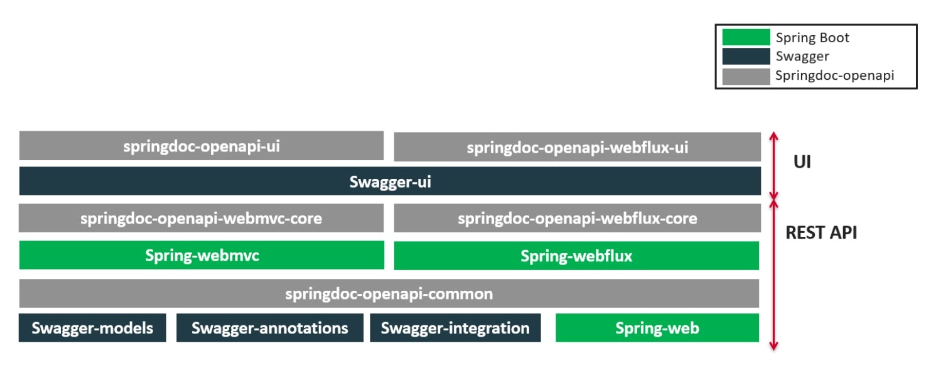

### Spring Boot REST API documentation using SpringDoc version 1 supporting OpenAPI 3.0

**Note:**
This SpringDoc library version supports:
- OpenAPI 3
- Spring Boot (v1, v2 and v3)

`http://localhost:8080/v3/api-docs`

`http://localhost:8080/swagger-ui.html`

`http://localhost:8080/v3/api-docs.yaml`

### springdoc-openapi v1

