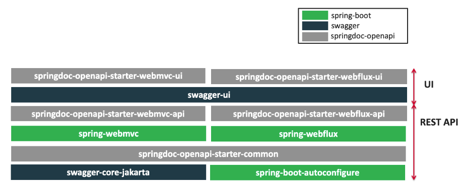
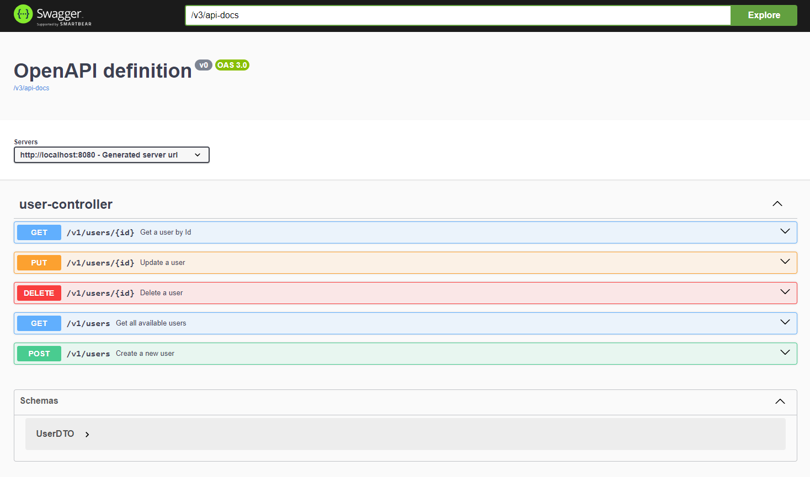

### Spring Boot REST API documentation using SpringDoc version 2 supporting OpenAPI 3.0

**Note:** This SpringDoc library version 2 supports:
- OpenAPI 3
- Spring Boot (v3)

`http://localhost:8080/v3/api-docs`

`http://localhost:8080/swagger-ui/`

### springdoc-openapi v2

### Documentation Accessibility
